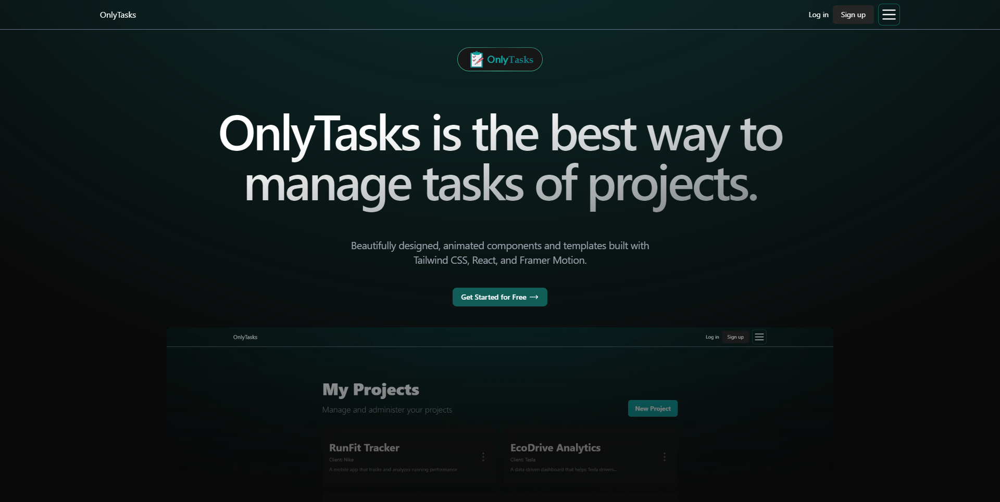

# 
# OnlyTasks

> A small webapp based on MERN stack.

## Demo 🎮

> 📝 First time deployment may take a few seconds because of the free hosting service.

Here is a working live demo:\
⌛️ Coming soon

Link to API documentation:\
⌛️ Coming soon

## Project preview 💻
⌛️ Coming soon

## Technologies 🛠️

The following technologies were used to develop this application:

- npm
- Vite
- React
- TypeScript
- TailwindCSS
- React Router DOM
- NodeJS
- ExpressJS
- Zod
- Mongoose
- MongoDB
- HTML
- JavaScript
- ⌛️ Coming soon

## Author

- **Name:** Jordi Martinez Jimenez
- **Contact:** 
- **Demo:** [Demo](https://github.com/jordimartinezjimenez/onlytasks-frontend/)
- **API Doc:** [Demo](https://github.com/jordimartinezjimenez/onlytasks-backend/)